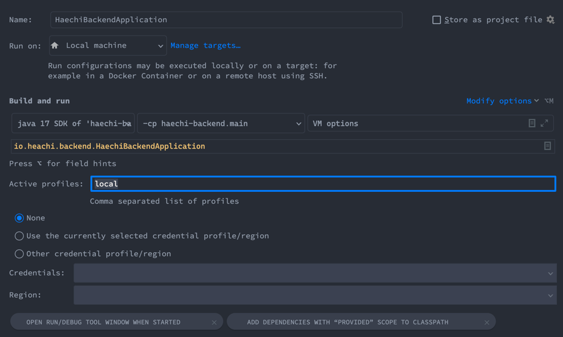
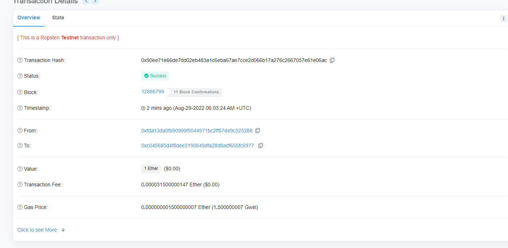

# MY WALLET

- Spring Boot, JPA + QueryDSL, Web3J, PostegreSQL를 기본으로 사용했습니다.

### Project 설정

- QueryDSL사용으로 QClass 생성을 위해 gradle compileQuerydsl을 수행해야합니다.
- 기본 `application.yml`은 배포용으로 active profile을 local로 변경합니다.
- PostgreSQL은 `heachi/gocl00!!`로 접속해야합니다.


### API 요구사항

#### 1. 지갑 생성

```
POST {{url}}/wallets

request body : {
    "password": "16자리의 숫자 + 영문 조합의 문자열"
}
```

- 사용자가 설정한 16자리의 비밀번호를 기반으로 Private Key 암호화 수행

#### 2. 지갑 ETH 잔액 조회

```
GET {{url}}/wallets/:address

request param : {
    "address": "지갑의 주소(Address)"
}

response : {
    "address": "요청한 지갑의 주소",
    "balance": "지갑의 ETH 잔액 [ex) 15.798031039989080000]"
    "useableBalance": "실제 출금 가능한 ETH 잔액"
}
```

- Pending상태와 같은 트랜잭션의 영향으로 실제 출금이 가능한 잔액을 따로 표시합니다.

#### 3. 출금

```
POST {{url}}/transactions

request body : {
    "fromAddress": "출금할 지갑의 주소"
    "password": "출금할 지갑의 패스워드 (지갑 생성시 입력한 암호)"
    "toAddress": "입금할 지갑의 주소"
    "eth": "입급할 금액"
}

response : {
    "Transaction Created (출력시 송금 성공)" 
}
```

#### 4. 입출금 이벤트 조회

```
GET {{url}}/transactions/events

param: {
  size: 기본 10, 최대 100으로 한번에 조회할 이벤트의 갯수,
  page: 조회할 페이지 번호,
  starting_after: 조회를 시작할 시간 (yyyy-MM-ddTHH:mm:ss ex.2022-08-28T01:00:00)
  ending_before: 조회를 시작할 시간 (yyyy-MM-ddTHH:mm:ss ex.2022-08-28T01:00:00)
}

response : {
    "idfEvent": 이벤트 고유 식별 번호,
    "hash": 이벤트가 발생한 트랜잭션의 해시,
    "status": 이벤트가 발생한 시점의 트랜잭션 상태,
    "blockConfirmation": 이벤트가 발생한 시점의 트랜잭션 blockConfirmation,
    "createdAt": 이벤트 발생 시간
}
```

#### 5. 지갑의 트랜잭션 조회

```
GET {{url}}/wallets/:address/transactions

request param: {
    "address": "입출금 이벤트를 조회할 지갑의 주소"
}

response : {
    "idfTransaction": "고유 식별 번호"
    "hash": "Transaction의 Hash값"
    "status": "트랜잭션 처리상태 (PENDING, MINED, CONFIRMED)"
    "blockConfirmation (Optional)": "트랜잭션이 블록에 채굴된 뒤 추가로 쌓인 블록의 수"
    "value": "전송할 ETH의 양"
    "fee (Optional)": "전송시 사용된 ETH 수수료"
    "from": "출금한 지갑의 주소"
    "to": "입금받은 지갑의 주소"
}
```

### PACKAGE 구조

```
   backend
   ├──api
   │   ├── transaction
   │   ├── wallet
   ├──domain
   │   ├── transaction
   │   ├── wallet
   ├──exception
   ├──infra
   │   ├── blockchain
   │   ├── ctypto
   ├──observer
```

#### 1. API

api패키지는 MVC패턴에 맞게 설계되어 있습니다. 실제 사용자가 호출하게 될 4가지의 API 명세가 구현되어 있으며 도메인을 기준으로 하위 패키지를 구성했습니다.   
도메인은 사용자의 지갑을 의미하는 wallet과 실제 입출금이 일어나고 내역을 조회 가능한 transaction으로 이루어져 있습니다.

#### 2. Domain

각 도메인을 구성하는 데이터 모델(Entity, Repository)를 포함하고 있습니다. JPA를 기반으로 생성되어 각 Entity객체와 PostgreSQL의 테이블이
대응됩니다.  
API와 마찬가지로 도메인을 기준으로 서브 패키지가 구성됩니다.

#### 3. Exception

API의 생명주기에서 Runtime Exception을 처리해주는 패키지입니다. 에러코드에 따라 500(Internal Server Error) 또는 404(Not Found
Error)를 클라이언트에 전송합니다.

```json
{
  "errorCode": "에러 코드 번호",
  "errorMsg": "에러 메세지",
  "payload": "에러에 따른 추가 정보"
}
```

#### 4. Infra

어플리케이션의 기능을 위한 외부 모듈 또는 환경과 연결하기 위한 매니저, 커넥터, 유틸등을 포함하는 패키지입니다. web3j를 직접 사용하고 Wrapping해주는
blockchain패키지와 암호화를 위한 AesUtil을 포함한 crypto패키지로 구성됩니다.

#### 5. Observer

테스트넷과 실시간으로 연결하여 입출금 트랜잭션을 구독하고 Service를 이용해 데이터 처리를 관리합니다. API 패키지의 Service를 이용하며 구독 실행 및 해당 정보에 대한
Controller역할을 수행합니다.

* subscribeBlock의 Flowable를 TransactionService에서 처리시 @Transactional처리에 문제를 발견하여 Observer에서
  infra.blockchain.Ethereum을 직접 사용하여 TransactionService로 전파합니다.

### 테스트 시나리오

테스트 시나리오는 보내주신 테스트 시나리오를 기반으로 작성했습니다.

1. 지갑생성 API 호출

- 생성에 성공한 address의 주소를 출력해 줍니다.
- Private Key는 암호화 되어 Password없이 복호화가 불가합니다.

```json
{
  "code": 0,
  "payload": {
    "address": "0xc045685d4f8dee3190849dfa28d8adf655fc6977",
    "balance": 0
  }
}
```

2. 생성한 지갑으로 전송

- 생성한 지갑으로 1ETH를 전송합니다.
- wallets/:address/transactions를 통해 불러온 트랜잭션 정보입니다.
- 이더스캔을 통해 확인한 트랜잭션 정보를 함께 첨부합니다.

```json
{
  "idfTransaction": 71,
  "hash": "0x90ee71e66de7dd02eb483a1c6eba67ae7cce2d066b17a276c2667057e61e06ac",
  "status": "CONFIRMED",
  "blockConfirmation": 12,
  "value": 1.000000000000000000,
  "fee": 0.000031500000147000,
  "from": "0xfda13da0fb90999f9544971bc2ff87de9c525288",
  "to": "0xc045685d4f8dee3190849dfa28d8adf655fc6977"
}
```



3. 2ETH 외부 지갑에 전송

- 이더리움 부족에 의해 트랜잭션이 실패합니다.
- 500 (Internal Server Error)와 함께 지갑 부족에 대한 안내를 출력합니다.

```json
{
  "errorCode": 201,
  "errorMsg": "NotEnough_Balance",
  "payload": "지갑의 잔액이 부족합니다."
}
```

4. Transaction 수행 (0.5ETH 전송)

- 1ETH를 받은 지갑으로 0.5ETH 전송

```json
{
  "idfTransaction": 72,
  "hash": "0x76b88b2f1e290e344e8466295524d340d18bae2261a64a470b9e9b549fdf1c94",
  "status": "CONFIRMED",
  "blockConfirmation": 12,
  "value": 0.500000000000000000,
  "fee": 0.000450960000960000,
  "from": "0xc045685d4f8dee3190849dfa28d8adf655fc6977",
  "to": "0xFDA13da0FB90999F9544971bC2fF87DE9c525288"
}
```

5. 0.5 ETH 전송

- Confirmed 이전에 사용 가능한 잔액을 초과한 금액의 출금을 요청할 경우 별도의 에러로 처리했습니다.

```json
{
  "errorCode": 202,
  "errorMsg": "NotEnough_ChainBalance",
  "payload": "출금가능한 지갑의 잔액이 부족합니다. PENDING중이거나 MINED상태의 트랜잭션을 확인해 주세요."
}
```

6. EventList API 호출

- 시간의 역순으로 출력

```json
[
  {
    "idfEvent": 170,
    "hash": "0x76b88b2f1e290e344e8466295524d340d18bae2261a64a470b9e9b549fdf1c94",
    "status": "CONFIRMED",
    "blockConfirmation": 12,
    "createdAt": "2022-08-29 06:15:06"
  },
  {
    "idfEvent": 169,
    "hash": "0x76b88b2f1e290e344e8466295524d340d18bae2261a64a470b9e9b549fdf1c94",
    "status": "MINED",
    "blockConfirmation": 12,
    "createdAt": "2022-08-29 06:15:06"
  },
  ...
  {
    "idfEvent": 158,
    "hash": "0x76b88b2f1e290e344e8466295524d340d18bae2261a64a470b9e9b549fdf1c94",
    "status": "MINED",
    "blockConfirmation": 1,
    "createdAt": "2022-08-29 06:12:36"
  },
  {
    "idfEvent": 157,
    "hash": "0x76b88b2f1e290e344e8466295524d340d18bae2261a64a470b9e9b549fdf1c94",
    "status": "PENDING",
    "blockConfirmation": 0,
    "createdAt": "2022-08-29 06:12:12"
  },
  {
    "idfEvent": 156,
    "hash": "0x90ee71e66de7dd02eb483a1c6eba67ae7cce2d066b17a276c2667057e61e06ac",
    "status": "CONFIRMED",
    "blockConfirmation": 12,
    "createdAt": "2022-08-29 06:08:57"
  },
  {
    "idfEvent": 155,
    "hash": "0x90ee71e66de7dd02eb483a1c6eba67ae7cce2d066b17a276c2667057e61e06ac",
    "status": "MINED",
    "blockConfirmation": 12,
    "createdAt": "2022-08-29 06:08:57"
  },
  {
    "idfEvent": 154,
    "hash": "0x90ee71e66de7dd02eb483a1c6eba67ae7cce2d066b17a276c2667057e61e06ac",
    "status": "MINED",
    "blockConfirmation": 11,
    "createdAt": "2022-08-29 06:08:56"
  },
  ...
]
```

### 회고

[회고로 가기](https://github.com/JeongYS/my_wallet-backend/wiki/%ED%94%84%EB%A1%9C%EC%A0%9D%ED%8A%B8-%ED%9A%8C%EA%B3%A0)